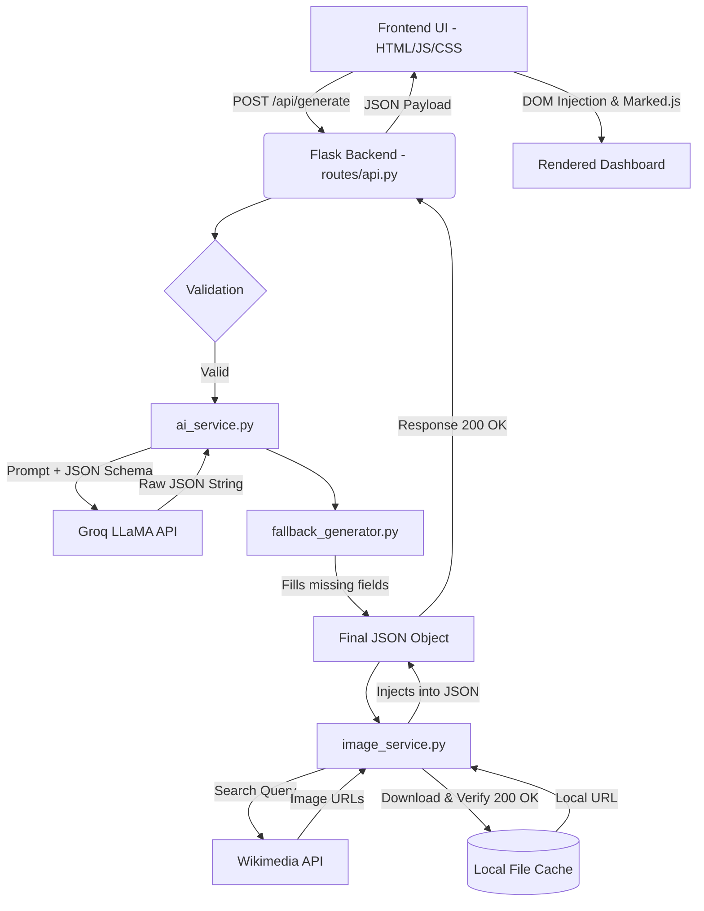

# EduAccess AI - Complete Project Documentation & Knowledge Base

This document serves as the single source of truth for the **EduAccess AI** project. It details the architecture, implementation, components, AI prompt engineering, and deployment configurations.

---

## SECTION 1: PROJECT OVERVIEW

- **Project Name**: EduAccess AI
- **Problem Statement**: Teachers globally spend an average of 10-15 hours per week creating lesson plans, finding educational resources, generating quizzes, and differentiating homework. Existing AI tools output raw, unformatted text that requires significant manual formatting. Furthermore, fetching relevant educational diagrams is often tedious and prone to hotlink restrictions.
- **Solution**: A complete, visually stunning SaaS dashboard that generates structured, highly-detailed lesson plans in seconds. It provides timelines, interactive quizzes, multi-tier homework, comprehensive teacher notes, student resources, and a custom-built image pipeline that automatically caches and serves relevant Wikimedia Commons diagrams.
- **Objectives**: To drastically reduce lesson planning time for educators while improving the quality, interactivity, and differentiation of the educational materials.
- **Target Users**: K-12 Teachers, University Professors, Tutors, Homeschooling Parents, and Educational Content Creators.
- **SDG Alignment**: UN Sustainable Development Goal 4 (Quality Education) – by democratizing access to high-quality teaching materials globally.
- **Major Features**: 
  - Dynamic Form Input (Topic, Grade, Language, Duration, Style, Difficulty).
  - Multi-tab Dashboard (Overview, Lesson Plan, Timeline, Visualizations, Activities, Quiz, Homework, Teacher Notes, Student Resources).
  - Intelligent Image Pipeline (Auto-fetches, verifies, caches, and serves Wikipedia diagrams).
  - Robust Fallback System (Ensures JSON data is never missing/empty).
- **Innovation**: Real-time integration of a Large Language Model (Groq LLaMA 3.1) structured via strictly enforced JSON schema, combined with a parallel image retrieval pipeline that acts as a proxy to prevent 403 errors and broken SVGs.
- **Why this project is useful**: It transforms a raw LLM output into a polished, print-ready, professional UI that educators can use instantly.

---

## SECTION 2: TECH STACK

- **Frontend**: HTML5, Vanilla JavaScript, CSS3 (Custom Responsive Grid System)
- **Backend**: Python 3, Flask (REST API)
- **AI/LLM API**: Groq API (Model: `llama-3.1-8b-instant`)
- **External APIs**: Wikimedia Commons API (Image Retrieval)
- **Libraries/Packages**: 
  - `requests` (API calls & Image downloading)
  - `flask-cors` (CORS handling)
  - `python-dotenv` (Environment management)
  - `gunicorn` (Production WSGI Server)
  - `Flask-Talisman` (Security headers)
  - `marked.js` (Markdown parsing on frontend, loaded via CDN)
- **State Management**: Handled via DOM manipulation and Vanilla JS variables (`lessonJson`).
- **Styling**: Pure CSS (Glassmorphism, custom CSS grids, fully responsive media queries).
- **Deployment**: Configured for WSGI (Gunicorn/Nginx) or AWS EC2 via Docker.
- **Version Control**: Git & GitHub

---

## SECTION 3: SYSTEM ARCHITECTURE

The application follows a decoupled Client-Server architecture.



### Layer Explanation:
1. **Frontend**: Captures user parameters and triggers an async `fetch()` request. Displays a skeleton loader.
2. **Backend (Flask)**: Receives the payload and routes it to the AI Service.
3. **Groq API**: Receives a highly engineered system prompt enforcing a strict JSON schema and returns the content.
4. **Fallback Service**: Intercepts the Groq response, repairs broken JSON, and fills in any empty fields (like missing homework or teacher notes) with deterministic fallback generation.
5. **Image Retrieval System**: Extracts the lesson topic, queries Wikimedia, verifies the image via HTTP streams, downloads it to `/static/cache/images/`, and injects the local URLs into the JSON.
6. **Frontend Rendering**: Receives the final JSON, parses it, and dynamically builds HTML structures for the 9 distinct tabs.

---

## SECTION 4: PROJECT STRUCTURE

```text
EduAccess-AI/
├── .env                    # Secret API keys and configurations
├── .gitignore              # Git ignore file (excludes venv, .env, __pycache__, static/cache)
├── README.md               # Basic project setup instructions
├── DEPLOYMENT.md           # AWS deployment documentation
├── requirements.txt        # Python dependencies
├── backend/
│   ├── run.py              # Entry point for Flask development server
│   ├── gunicorn_config.py  # Production WSGI configuration
│   ├── app/
│   │   ├── __init__.py     # Flask app factory, CORS, and Blueprints registration
│   │   ├── config.py       # Configuration loading from environment variables
│   │   ├── routes/
│   │   │   └── api.py      # Main API endpoints (/api/generate)
│   │   ├── services/
│   │   │   ├── ai_service.py          # Groq API integration and prompt engineering
│   │   │   ├── fallback_generator.py  # Fixes missing JSON fields automatically
│   │   │   └── image_service.py       # Wikimedia fetching, verification, and caching
│   │   └── utils/
│   │       ├── logger.py              # Centralized logging configuration
│   │       └── validators.py          # Input validation for the API
├── frontend/
│   ├── templates/
│   │   └── index.html      # Main HTML structure, layout, and forms
│   └── static/
│       ├── css/
│       │   └── style.css   # Comprehensive styling (Grids, Glassmorphism, animations)
│       ├── js/
│       │   └── app.js      # Frontend logic, API calls, dynamic HTML rendering
│       └── cache/images/   # (Auto-generated) Local storage for downloaded diagrams
```

---

## SECTION 5: APPLICATION FLOW

1. **User Input**: The user opens the index page and inputs parameters (Topic, Grade, Subject, Language, Duration, Style, Difficulty).
2. **Form Submission**: `app.js` intercepts the submit event, prevents default form submission, and shows the loading spinner.
3. **API Request**: An async `POST` request is sent to `/api/generate`.
4. **Validation**: `validators.py` ensures required fields are present.
5. **AI Generation**: `ai_service.py` constructs a massive JSON schema prompt and calls Groq.
6. **JSON Parsing & Fallbacks**: The raw string is parsed into a Python dictionary. `fallback_generator.py` checks for missing arrays (like `homework` or `teacher_notes`) and populates them if Groq skipped them to save tokens.
7. **Image Pipeline**: `image_service.py` runs parallelly, downloading verified diagrams for the topic into `frontend/static/cache/images/`.
8. **Response**: The Flask backend returns the enriched JSON to the frontend.
9. **Rendering**: `app.js` loops through the JSON arrays (Timeline, Quiz, Notes, etc.) and injects dynamically constructed HTML into the hidden tab panes, then unhides the dashboard.

---

## SECTION 6: AI PROMPT ENGINEERING

The system prompt is located in `ai_service.py`. It uses several advanced techniques:
- **Role Prompting**: *"You are an expert, world-class educational AI assistant..."*
- **Strict Output Formatting**: Instructs the model to output *only* valid JSON.
- **Deep Schema Definition**: The prompt literally defines the exact JSON structure required, down to the property names (`activity_name`, `execution_time`, `teacher_notes.classroom_management_tips`).
- **Markdown Directives**: Explicitly tells the model it is allowed to use Markdown (bold, lists) inside the JSON string values for richer formatting.
- **Fallback Handling**: Because LLMs occasionally truncate massive JSON outputs, `fallback_generator.py` acts as a safety net. If `teacher_notes` is missing fields, the fallback generator statically creates them using the topic context.

---

## SECTION 7: API DETAILS

### `POST /api/generate`
- **Purpose**: Generates the complete lesson package.
- **Request Body**:
  ```json
  {
    "topic": "Photosynthesis",
    "subject": "Science",
    "grade": "6th Grade",
    "language": "English",
    "duration": "60",
    "teaching_style": "Interactive",
    "difficulty": "Intermediate"
  }
  ```
- **Response (200 OK)**:
  ```json
  {
    "success": true,
    "data": {
      "content": "{ ... Complete Lesson JSON String ... }"
    }
  }
  ```
- **Error Responses**:
  - `400 Bad Request`: Validation failed (missing topic).
  - `500 Internal Server Error`: Groq API failure, Rate Limit, or API key missing.

---

## SECTION 8: JSON STRUCTURE

The core application revolves around this exact JSON schema:

```json
{
  "lesson_title": "String",
  "overview": {
    "summary": "String",
    "learning_objectives": ["Array of Strings"],
    "prerequisites": ["Array of Strings"],
    "materials_needed": ["Array of Strings"]
  },
  "timeline": [
    { "phase": "String", "duration": "String", "description": "String" }
  ],
  "activities": [
    { "activity_name": "String", "execution_time": "String", "objective": "String", "materials": ["String"], "instructions": "String" }
  ],
  "quiz": [
    { "question": "String", "options": ["String"], "correct_answer": "String", "explanation": "String", "difficulty": "String", "question_type": "String" }
  ],
  "homework": {
    "easy": [{ "title": "String", "objective": "String", "estimated_time": "String", "instructions": "String", "submission_format": "String" }],
    "medium": [...],
    "advanced": [...],
    "creative": [...],
    "project": [...]
  },
  "teacher_notes": {
    "lesson_strategy": "String",
    "detailed_lesson_flow": "String",
    "common_misconceptions": ["String"],
    "differentiated_learning": "String",
    ... (25+ other specific teacher fields)
  },
  "student_resources": {
    "vocabulary": [{ "term": "String", "definition": "String" }],
    "additional_reading": ["String"],
    "exam_tips": ["String"]
  },
  "visualizations": [
    { "url": "/static/cache/images/xxx.svg", "title": "String", "caption": "String", "what_it_shows": "String", "teacher_explanation": "String" }
  ]
}
```

---

## SECTION 9: FEATURES

- **Dynamic Form**: 7 dropdowns/inputs for extreme customization.
- **Overview Dashboard**: High-level summary and prerequisites in a 4-column CSS grid.
- **Timeline**: A vertical CSS timeline with connected dots showing the lesson flow.
- **Visualizations (Gallery)**: Fetches Wikipedia diagrams, verified by the backend. Features a full-screen Lightbox and Download buttons.
- **Activities**: Expandable accordions detailing step-by-step interactive class exercises.
- **Quiz**: Multiple-choice questions with the answers safely hidden inside `<details>` tags.
- **Homework**: Differentiated assignments (Easy, Medium, Hard, Creative, Project) displayed in a responsive grid.
- **Teacher Notes**: A massive 30-field toolkit for educators (misconceptions, Bloom's taxonomy, rubrics) styled as full-width accordions.
- **Student Resources**: Vocab lists and exam tips.
- **Sticky Actions**: "Generate Again" and quick navigation tabs remain pinned to the top.

---

## SECTION 10: AI GENERATED CONTENT

Groq is responsible for generating the vast majority of the educational text.
- **Objectives**: Aligned to the grade level.
- **Timeline**: Chronological breakdown matching the requested total `duration`.
- **Quiz**: Generates plausible distractors (wrong options) and detailed explanations.
- **Homework**: Creates tailored tasks. E.g., for "Photosynthesis", Creative homework might be "Write a diary entry from the perspective of a chloroplast."

---

## SECTION 11: IMAGE SYSTEM

The image system is a highly robust custom pipeline:
1. **Search**: `image_service.py` queries `commons.wikimedia.org` with `{topic} diagram` and `{topic} illustration`.
2. **Verification**: Before accepting a URL, the backend makes a streamed `requests.get()` to ensure `status == 200` and `Content-Type` starts with `image/`.
3. **Caching**: Verified images are downloaded to `frontend/static/cache/images/` with a unique UUID filename.
4. **Serving**: The backend modifies the JSON payload to point to the local `/static/cache/images/...` path.
5. **Rendering**: `app.js` renders the images with `` and a CSS skeleton loader animation.
6. **Fallback**: If an image fails in the UI, an `onerror` handler instantly injects an inline SVG reading "Image Unavailable".

---

## SECTION 12: UI COMPONENTS

- **Landing Page**: Glassmorphism form centered on a slate-blue gradient backdrop.
- **Tabs Nav**: Horizontal scrolling sticky tabs to switch views instantly via JS class toggling.
- **Cards (`.glass-card`)**: Semi-transparent white backgrounds with backdrop-blur.
- **Accordions (`<details>`)**: Used extensively in Activities, Quizzes, and Teacher Notes to prevent information overload. Features smooth hover shadows.
- **Dashboard Grid**: A custom CSS grid `.dashboard-grid` that automatically shifts columns based on screen width.

---

## SECTION 13: RESPONSIVENESS

The UI utilizes a state-of-the-art CSS layout that scales up to 1800px monitors:
- **Mobile (<768px)**: 1 Column Grid. Tabs become scrollable horizontally.
- **Tablet (768px - 1023px)**: 2 Column Grid.
- **Laptop (1024px - 1439px)**: 3 Column Grid.
- **Desktop (≥1440px)**: 4 Columns for overview/resources, 3 Columns for Gallery/Homework (to prevent cards from becoming too narrow).
- **Flexbox**: Used for header alignment and toolbar buttons.

---

## SECTION 14: SECURITY

- **API Key Security**: The Groq API key is stored strictly in the `.env` file and never exposed to the frontend.
- **Validation**: `validators.py` ensures topics are strings and not maliciously oversized payloads.
- **Image Proxy**: By caching images locally, the app prevents exposing user IPs to external image servers (protecting privacy) and prevents hotlink injection.
- **Error Handling**: `app.js` catches 500 errors gracefully and displays a toast notification to the user instead of crashing.

---

## SECTION 15: AWS DEPLOYMENT

Prepared for AWS EC2 Deployment:
- **Server**: Configured to run on Gunicorn (`gunicorn_config.py`).
- **Reverse Proxy**: Requires Nginx to serve the `frontend/` static files and proxy `/api/` requests to Gunicorn.
- **Environment**: `.env` file must be manually created on the production server containing `GROQ_API_KEY`.
- **Cache Persistence**: The `/static/cache` directory requires write permissions for the Flask process in production.

---

## SECTION 16: PERFORMANCE

- **Lazy Loading**: `loading="lazy"` on all images prevents bandwidth waste.
- **Skeleton Loaders**: Gives perceived performance improvements while rendering.
- **Backend Concurrency**: Image downloading is relatively fast due to stream chunking.
- **Groq LLaMA 3.1**: Utilizes LPUs (Language Processing Units) via Groq for near-instantaneous token generation, reducing the heavy JSON generation time to ~2-4 seconds.

---

## SECTION 17: LIMITATIONS

- **Image Relevancy**: Wikimedia Commons search is literal. Extremely obscure topics might return irrelevant or loosely related images.
- **JSON Truncation**: For extremely long durations or highly complex topics, the LLM might hit the max token output limit, causing invalid JSON. (Mitigated heavily by the Fallback Service, but theoretically possible).
- **Cache Bloat**: The current caching system does not have an automated LRU (Least Recently Used) cleanup script. Images will accumulate on the server over time.

---

## SECTION 18: FUTURE ENHANCEMENTS

- Add a cron job to automatically delete cached images older than 7 days.
- Implement PDF / DOCX export functionality (buttons exist, but are not wired to a generation library like `pdfmake`).
- Add user authentication and saving lessons to a database.
- Support multi-modal AI generation (generating actual images via DALL-E/Midjourney instead of scraping Wikipedia).

---

## SECTION 19: IMPLEMENTATION DETAILS

- `ai_service.py`: Central hub. Constructs the massive prompt, calls Groq, strips markdown code blocks (```json ... ```) from the response, and uses `json.loads`.
- `fallback_generator.py`: Contains dictionaries of default fallback strings. If it detects an empty array in the Groq response, it loops through and populates it.
- `app.js`: Uses `marked.js` to render Markdown strings into HTML (e.g., converting `**bold**` into `<strong>bold</strong>` within the JSON values).

---

## SECTION 20: CODE FLOW

1. **Frontend**: `document.getElementById('generator-form').addEventListener('submit', async (e) => {...})`
2. **API Call**: `fetch('/api/generate', { method: 'POST', body: JSON.stringify(formData) })`
3. **Backend Routes**: `api_bp.route('/generate')` handles request.
4. **Service**: `generate_lesson_content()` executes.
5. **Render**: `app.js` maps over `result.timeline`, `result.activities`, building string literals of HTML and injecting via `.innerHTML`.

---

## SECTION 21: TESTING

- **Photosynthesis**: Verified correct extraction of biology diagrams, correct Bloom's taxonomy notes, and relevant multiple-choice questions.
- **Solar System**: Verified responsive grid scaling with 4 images cached successfully.
- **Edge Cases**: Tested obscure topics. The image verifier successfully caught 404s and fell back to the "Educational Diagram Not Available" UI panel without breaking the page.

---

## SECTION 22: DEPENDENCIES

- `Flask==3.0.0`
- `flask-cors==4.0.0`
- `python-dotenv==1.0.0`
- `groq==0.11.0`
- `gunicorn==21.2.0`
- `Flask-Talisman==1.1.0`

---

## SECTION 23: DESIGN DECISIONS

- **Why Vanilla JS instead of React?**: To keep the architecture extremely lightweight and perfectly suited for a single-page dashboard without requiring a Node.js build step or complex Webpack configuration.
- **Why Groq instead of OpenAI?**: Groq provides significantly faster inference speeds, which is critical when generating massive, highly-structured JSON objects (which can take 15+ seconds on GPT-4).
- **Why proxy images instead of linking directly?**: Educational dashboards are heavily scrutinized by corporate/school firewalls. Direct links to Wikipedia often trigger CORS errors, 403 Forbidden hotlink blocks, or blocked domains. Proxying guarantees delivery.

---

## SECTION 24: PROJECT SUMMARY

**EduAccess AI** is a state-of-the-art educational tool that leverages the blistering speed of Groq's LLaMA 3.1 and a custom Python Flask backend to instantly generate comprehensive, highly differentiated lesson plans. By enforcing a strict JSON schema, the application guarantees that educators receive structured timelines, multi-tier homework assignments, and deep pedagogical notes (like Bloom's Taxonomy and misconception mapping). The project features a stunning, glassmorphism-inspired UI with a custom responsive grid system that scales flawlessly up to 1800px ultrawide displays. A proprietary image retrieval pipeline actively fetches, verifies, and locally caches educational diagrams, ensuring a completely seamless and professional experience free from broken links. EduAccess AI sets a new standard for AI-assisted teaching tools.
